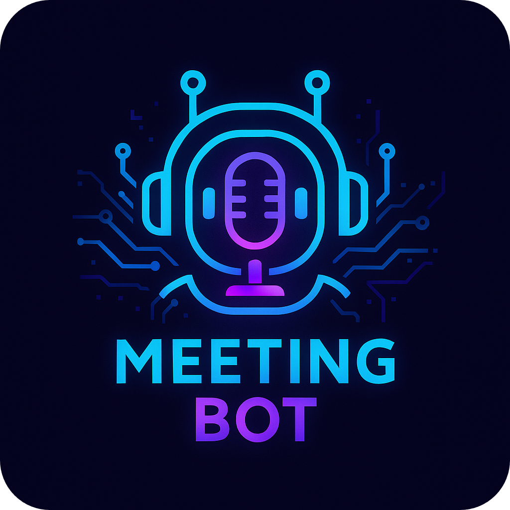

<p align="center" >
  
</p>

# Discord Voice Recording Bot

An open‑source Discord bot that automatically records voice conversations, transcribes them locally, and generates AI‑powered meeting summaries. Ideal for teams capturing discussions, standups, and decision logs.

## Features

🎙️ **Automatic Voice Recording**
- Auto‑joins voice channels when users are present
- High‑quality per‑speaker PCM capture
- 5‑minute processing cycles to minimize memory usage
- Segment merging and final audio compilation
- Manual control via slash commands (`/join`, `/leave`) or text (`!join`, `!leave`)

🤖 **AI‑Powered Processing**
- Local transcription via Python script (Whisper-compatible runner)
- AI summaries with Google Gemini
- Automatic transcript and summary generation

📁 **Smart File Management**
- Stores audio and summaries locally
- Optional Google Drive upload (create/overwrite by filename)
- Organized by channel and timestamp

⚙️ **Configurable Settings**
- Toggle full pipeline vs. local testing
- Control audio retention and debug aids
- Flexible processing pipeline

## Prerequisites

Before setting up the bot, make sure you have:

- Node.js v16+ (v18+ recommended)
- Python 3.8+ (for transcription helper)
- FFmpeg (in PATH)
- Discord Bot Token (Developer Portal)
- Google API: Gemini API key; optional OAuth credentials for Drive uploads

## Installation

### 1) Clone the repository
```bash
git clone <your-repo-url>
cd Discord_Bot
```

### 2) Install Node.js dependencies
```bash
npm install
```

### 3) (Optional) Install Python dependencies
```bash
pip install -r requirements.txt  # if present
pip install vosk                 # or install packages individually as needed
```

### 4) (Optional) Download Vosk model
If you use a Vosk‑based pipeline, download an English model and extract it:
```bash
# Get a model from: https://alphacephei.com/vosk/models
# Example path: ./vosk-model-en-us-0.22/
```

### 5) Environment variables
Create a `.env` file with your values:
```env
# Discord
DISCORD_TOKEN=your_discord_bot_token
DISCORD_CLIENT_ID=your_discord_bot_client_id
DISCORD_GUILD_ID=your_guild_id  # Optional: if provided, commands are guild-specific

# Google Gemini
GEMINI_API_KEY=your_gemini_api_key

# Google Drive (Service Account recommended for GCP, or OAuth2 fallback)
FOLDER_ID=google_drive_folder_id
# SERVICE_ACCOUNT_KEY_PATH=/path/to/service-account-key.json  # Optional, defaults to service-account-key.json
```
Notes:
- `DISCORD_CLIENT_ID`: Your bot's application/client ID (found in Discord Developer Portal → General Information)
- `DISCORD_GUILD_ID`: Optional. If provided, slash commands are deployed to that specific server (updates instantly). If omitted, commands are global (available in all servers but may take up to 1 hour to propagate)
- **Google Drive Authentication**: 
  - **Service Account (Recommended for GCP)**: Place `service-account-key.json` in bot directory. No OAuth flow needed! See [GCP Setup Guide](GCP_SETUP.md) for details.
  - **OAuth2 (Fallback)**: `credentials.json` and `token.json` are used by `uploader.js` and should not be committed.
- `FOLDER_ID` is required if you plan to upload summaries to Google Drive.

### 6) Start the bot
The bot will automatically deploy slash commands when it starts up. No manual deployment needed!

## Configuration

### Environment variables (.env)

| Variable | Description | Required |
|----------|-------------|----------|
| `DISCORD_TOKEN` | Discord bot token | ✅ Yes |
| `DISCORD_CLIENT_ID` | Discord bot application/client ID | ✅ Yes |
| `DISCORD_GUILD_ID` | Discord server/guild ID (for guild-specific commands) | ⚪ Optional |
| `GEMINI_API_KEY` | Gemini API key | ✅ Yes |
| `FOLDER_ID` | Google Drive folder ID (uploader) | ⚪ If using uploads |

## Usage

### Start the bot
```bash
node bot.js
```

The bot will automatically:
- Join voice channels when users are present
- Leave when humans drop to 1 or fewer
- Record per‑speaker audio segments

### Manual commands

#### Slash commands
- `/join` – Join your current voice channel and start recording
- `/leave` – Stop recording and leave

#### Automatic behavior
- Auto‑Join when 2+ humans are present
- Auto‑Leave when <= 1 human remains
- Records only when users are speaking

### Processing recordings

#### Automatic processing
The bot processes 5‑minute segments in the background while recording.
#### Manual processing
You can also run the processor directly:
```bash
node processor.js
```

What it does:
1) Convert PCM → WAV (16kHz mono)
2) Transcribe via Python helper (Whisper‑compatible)
3) Summarize with Gemini
4) Save locally and optionally upload to Google Drive

## File structure

```
Discord_Bot/
├─ bot.js                 # Main bot (Discord gateway, recording, orchestration)
├─ processor.js           # Audio processing pipeline
├─ transcribe.py          # Python transcription helper
├─ commands.js            # Slash command definitions
├─ scheduler.js           # Operating hours scheduler
├─ uploader.js            # Optional Google Drive uploader (OAuth)
├─ cleanup.js             # Manual cleanup script
├─ process_existing.js    # Process existing PCM files utility
├─ PCM_Files/             # Temporary audio files (auto‑created)
├─ Summary/               # Generated summaries (auto‑created)
├─ Transcripts/           # Example transcripts (optional)
├─ .env                   # Environment variables (local, do not commit)
└─ token.json / credentials.json  # OAuth artifacts (uploader)
```

## How it works

### 1) Recording with 5‑minute cycles
- Joins voice channels via `@discordjs/voice`
- Detects speech activity and records per‑speaker PCM
- Every 5 minutes, creates a processed WAV segment
- At the end, merges segments for a final pass

### 2) Audio processing
- Converts PCM → WAV (16kHz mono, s16)
- Applies consistent format for transcription

### 3) Transcription
- Uses a Python helper script (`transcribe.py`)
- Compatible with local Whisper setups; adjust as needed
- Handles multi‑speaker conversations

### 4) AI summarization
- Sends transcript to Google Gemini
- Produces structured notes, key decisions, and action items

### 5) Storage
- Saves transcripts and summaries locally in `Summary/`
- Optional automatic uploads to Google Drive via `uploader.js`

## Troubleshooting

### Common Issues

#### "Bot doesn't join voice channels"
- Ensure the bot has Connect/Speak permissions
- Verify `DISCORD_TOKEN` is valid
- Check guild intents are enabled if required

#### "Audio issues"
- Ensure FFmpeg is installed and in PATH
- Keep `@discordjs/voice` and `prism-media` up to date

#### "Transcription fails"
- Confirm Python is installed
- Install required Python packages
- Ensure generated audio files are not empty

#### "Google Drive upload fails"
- Put `credentials.json` next to `uploader.js` and run once to create `token.json`
- Ensure `FOLDER_ID` is set
- Verify Drive API is enabled for your account

### Debug mode

The bot uses environment variables and automatic cleanup. For debugging, you can:
- Check bot logs for detailed information
- Use `process_existing.js` to process leftover PCM files
- Run `cleanup.js` manually to test the cleanup process

## API requirements

### Discord bot setup
1. Go to [Discord Developer Portal](https://discord.com/developers/applications)
2. Create a new application
3. Go to "Bot" section and create a bot
4. Copy the bot token
5. Invite bot to your server with necessary permissions

### Google APIs setup
1. Go to [Google Cloud Console](https://console.cloud.google.com/)
2. Create a new project or select existing
3. Enable Gemini API and Google Drive API
4. Create service account credentials
5. Download JSON key file
6. Get Gemini API key from AI Studio

## Contributing

1. Fork the repository
2. Create a feature branch
3. Make your changes (lint and test if applicable)
4. Open a Pull Request describing the change and rationale

## Deployment

The bot can be deployed on any cloud provider or VPS that supports Node.js and Python:

- **Google Cloud Platform (Compute Engine)** - [Complete Setup Guide](GCP_SETUP.md) ⭐ Recommended
- **AWS EC2**
- **Azure**
- **DigitalOcean**
- **Any VPS with Node.js and Python support**

### Deployment Requirements

- Node.js v18+ installed
- Python 3.8+ installed
- FFmpeg installed
- Persistent storage for audio files and summaries
- Process manager (systemd or PM2) for auto-restart

### Quick Start

**For Google Cloud Platform (Free Tier):**
- See the comprehensive [GCP Setup Guide](GCP_SETUP.md) for step-by-step instructions

**For Other Providers:**
- Follow similar steps as the GCP guide, adjusting for your provider's specific requirements
- Use the deployment checklist: `DEPLOYMENT_CHECKLIST.md`

### Included Files

- `GCP_SETUP.md` - Complete GCP deployment guide
- `discord-bot.service` - systemd service configuration
- `ecosystem.config.js` - PM2 configuration
- `DEPLOYMENT_CHECKLIST.md` - Deployment checklist

## License

Licensed under the ISC License. See the `LICENSE` file.

## Support

For issues and questions:
- Check the troubleshooting section above
- Review Discord.js documentation
- Check Vosk model requirements
- Verify Google API setup
- Check deployment checklist for hosting issues

## Changelog

### v3.0.0 (latest) – 5‑minute processing cycle
- ✅ **NEW**: Implemented 5-minute processing cycles for efficient memory management
- ✅ **NEW**: Automatic PCM file merging every 5 minutes during recording
- ✅ **NEW**: Final audio file compilation when meeting ends
- ✅ **NEW**: Improved file cleanup and disk space management
- ✅ **NEW**: Enhanced processor.js to handle segmented audio files
- ✅ **NEW**: Added test script for functionality verification
- ✅ **NEW**: Backward compatibility with legacy PCM files

### v2.0.0
- ✅ Fixed demonic/distorted audio issues
- ✅ Switched to PCM recording mode
- ✅ Implemented speaking event detection
- ✅ Improved audio quality and reliability
- ✅ Added comprehensive error handling

### v1.0.0
- Initial release with basic recording functionality
